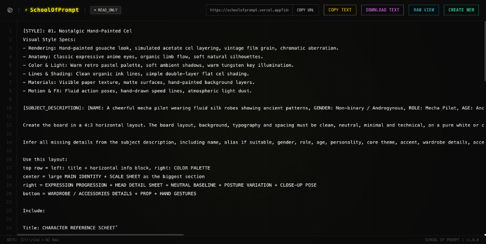
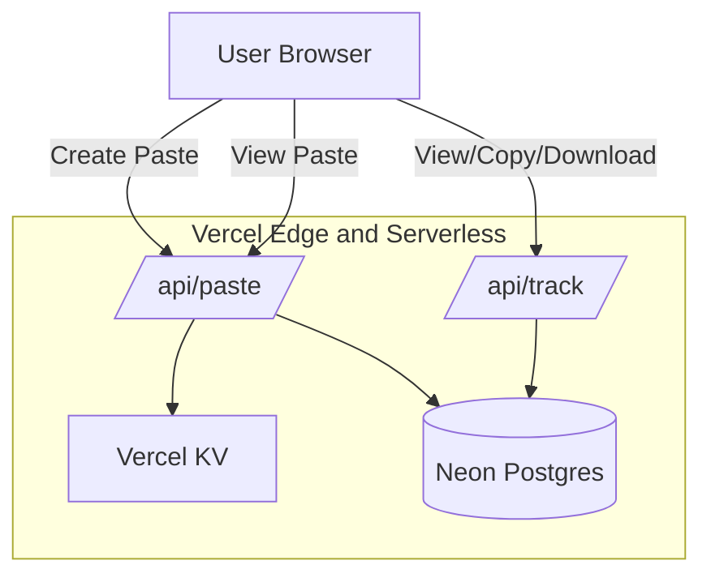

<div align="center">
  
  <h1>School of Prompt</h1>
  <p><strong>A blazingly fast, stealthy, and highly secure Pastebin clone engineered for sharing AI prompts with real-time Global Telemetry.</strong></p>

  [](https://opensource.org/licenses/MIT)
  [](https://nextjs.org/)
  [](https://vercel.com/)
  <br/><br/>
  <a href="https://schoolofprompt.vercel.app">
    
  </a>
  <br/><br/>
  
</div>

---

## ⚡ Overview

School of Prompt is a highly optimized, Cyber-HUD themed web application for instantly saving, sharing, and tracking plain-text data (like AI prompts or code snippets).

Engineered with performance and security in mind, it utilizes edge caching, serverless Postgres, and a stealthy Magic Link authentication portal for admins to access granular telemetry data.

## ✨ Features

- **Instant Sharing**: Create short-link (`/?id=XXXXXXX`) pastes instantly with no sign-up required.
- **Syntax Highlighting**: Auto-detects and highlights code using `highlight.js`.
- **Global Telemetry**: Secretly tracks views, copies, downloads, referrers, device types, and OS distribution.
- **Cyber-HUD Admin Dashboard**: A beautifully animated Recharts dashboard to monitor 14-day traffic trends and Save-to-Copy conversion rates.
- **Stealth Login Portal**: The `/zhonk` route acts as a hidden backdoor utilizing JWT Magic Links via Resend.
- **Rate Limiting**: Built-in Vercel KV rate limiting (10 requests/min per IP) to prevent spam.
- **Security Hardened**: CSP headers, Cross-Origin validation, and strict `SameSite=lax` cookie hardening.

## 🏗 System Architecture



## 🚀 Getting Started

### Prerequisites
- Node.js 18+
- npm or pnpm
- A [Vercel](https://vercel.com/) account (for deployment and databases)

### 1. Clone the repository
```bash
git clone https://github.com/yourusername/schoolofprompt.git
cd schoolofprompt
```

### 2. Install dependencies
```bash
npm install
```

### 3. Environment Variables
Copy the `.env.example` file to `.env.local`:
```bash
cp .env.example .env.local
```
Fill in `.env.local` with your Postgres, Resend, and KV credentials. Ensure you generate a secure random string for `SESSION_SECRET` (e.g., `openssl rand -base64 32`).

### 4. Initialize the Database
Before running the app, you must create the necessary tables in your Postgres database.
```bash
npm run dev
```
Then, visit `http://localhost:3000/api/init-db` in your browser. This will automatically execute the schema migrations.

### 5. Access the Dashboard
Navigate to `http://localhost:3000/zhonk` to request your Magic Link and access the Global Telemetry dashboard!

---

## 🔒 Security & Best Practices

This repository has been security hardened:
- **No Default Secrets**: The application will crash in `production` if `SESSION_SECRET` is missing.
- **CORS Protection**: The `/api/paste` route strictly validates the `Origin` header.
- **Payload Limits**: Paste creation enforces a hard 2MB payload limit.
- **Telemetry Sanitization**: IPs are cryptographically hashed using SHA-256 before being stored in the database to preserve user privacy.

---

## 🛠 Tech Stack

- **Framework**: Next.js 14 (App Router)
- **Styling**: Tailwind CSS, CSS Grid/Animations
- **Database**: Vercel Neon Postgres (`pg` client)
- **Rate Limiting**: Vercel KV Redis (w/ InMemory fallback)
- **Auth**: `jose` (JWT), Resend API
- **Charts**: Recharts
- **Icons**: Lucide-React

---

## 📜 API Documentation

### Create a Paste
`POST /api/paste`
```json
{
  "content": "Your raw text here",
  "language": "javascript" // optional
}
```
**Response (200 OK)**: `{ "id": "A1b2C3d" }`

### Get a Paste
`GET /api/paste?id=A1b2C3d`
**Response (200 OK)**: `{ "content": "Your raw text here", "language": "javascript" }`

*Add `&raw=true` to receive raw text instead of JSON.*

---

## 🤝 Contributing

Contributions are welcome! Please follow these steps:
1. Fork the project.
2. Create your feature branch (`git checkout -b feature/AmazingFeature`).
3. Commit your changes (`git commit -m 'Add some AmazingFeature'`).
4. Push to the branch (`git push origin feature/AmazingFeature`).
5. Open a Pull Request.

## 📄 License

Distributed under the MIT License. See `LICENSE` for more information.

> "A tool is only as good as the mind that wields it." - *School of Prompt*
